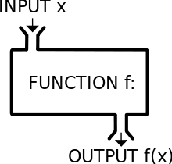

Introduction à la programmation fonctionnelle
===

##### Cas pratique

###### par [Fabien Barbaud](fabien.barbaud@timeonegroup.com) - [@BarbaudFabien](https://twitter.com/BarbaudFabien)

Présentation
===

[Slides](tp.md)
